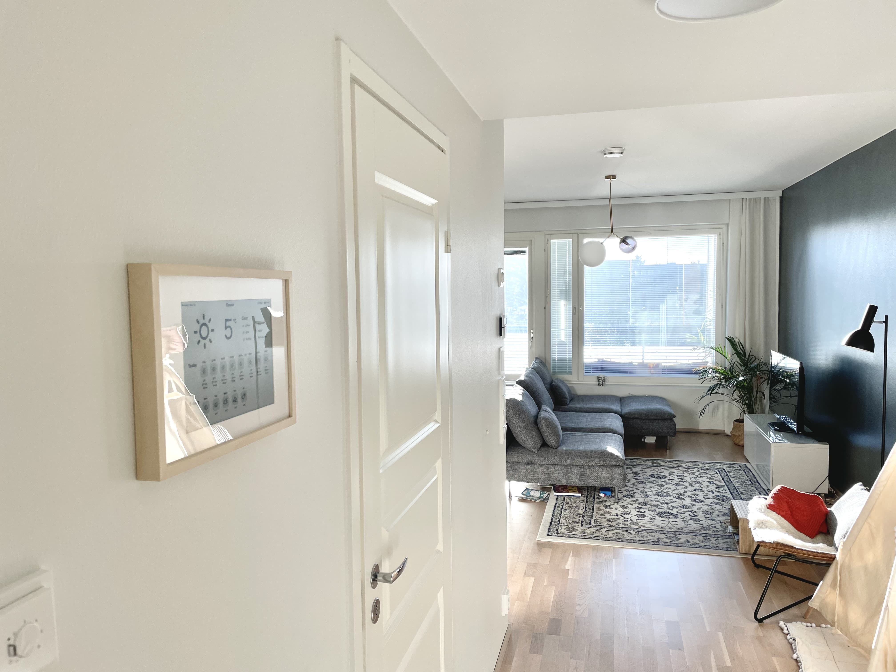
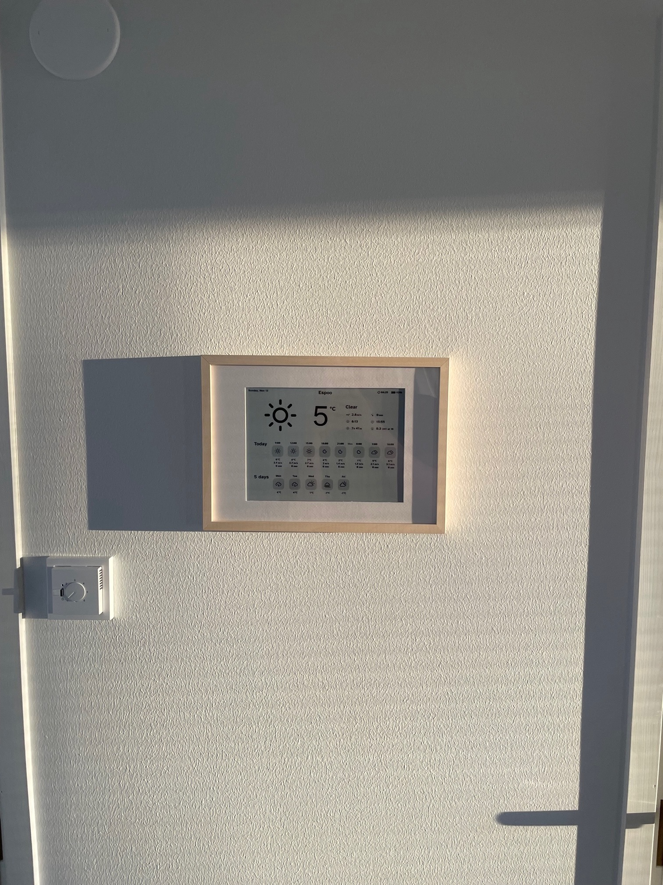
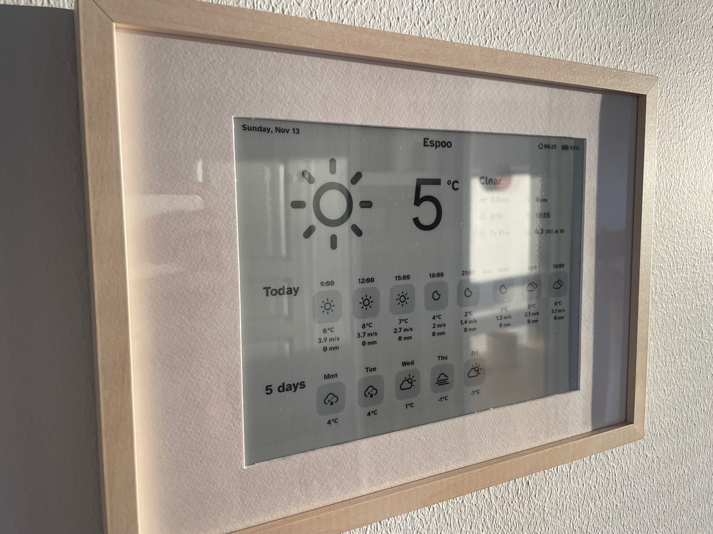

# eink-weather-display

Battery-powered E-Ink weather display for our home. The device wakes up early in the morning, fetches latest weather forecast information, updates the info to the E-Ink display, and goes back to deep sleep until tomorrow.

You can read more about the build in my [blog post](https://kimmo.blog/posts/7-building-eink-weather-display-for-our-home/).






**Goals:**

* Easily glanceable weather forecast at the heart of our home. Ideally eliminates one more reason to pick up the phone.
* Looks like a "real product". The housing should look professional.
* Fully battery-powered. We didn't want a visible cable, and drilling the cable inside wall wasn't an option.
* Always visible and doesn't light up the hallway during evening / night -> e-Ink display.
* Primarily for our use case, but with reusability in mind. For example custom location and timezone (some [tests](render/src/utils/utils.test.ts) too).

**Challenges:**

* Battery life.
    * PiJuice [GitHub isses mention](https://github.com/PiSupply/PiJuice/issues/815) that the deep sleep consumtion should be ~1mA, which theoretically means 12000 hours of idle time with the [12000mAh battery](https://uk.pi-supply.com/products/pijuice-12000mah-battery). It remains to be seen how long it will actually last.
* And due to battery constraints: low refresh speed. 1-2x per day is an interesting design challenge. How do you indicate that this data is not real time? What should we show as the day's temperature, average or maximum for the day?
* Physical constraints by the frame. Ideally it would be flush to the wall behind.

## Hardware

* Raspberry PI Zero W
* [PiJuice Zero](https://uk.pi-supply.com/products/pijuice-zero)
* [PiJuice 12000mAh battery](https://uk.pi-supply.com/products/pijuice-12000mah-battery). As large as possible to avoid having to charge the device often.
* [Waveshare 10.3" 1872x1404 e-Ink display with Raspberry PI HAT](https://www.waveshare.com/10.3inch-e-paper-hat.htm). Supports 16 shades of black and white.
* [Geekworm Raspberry Pi Installation Tool 132 Pcs](https://www.amazon.de/-/en/gp/product/B07MN2GY6Y/ref=ppx_yo_dt_b_asin_title_o00_s00?ie=UTF8&psc=1). For a set of spacers and screws that fit Raspberry PI projects nicely.
* Micro-usb to USB adapter
* USB to micro-usb cable
* [IKEA Hovsta Frame](https://www.ikea.com/fi/fi/p/hovsta-kehys-ja-kehyskartonki-koivukuvio-40365762/)
* Misc building items: hot glue, hair band to hold the battery, wall mounting hooks, small plastic box cut to pieces to support the battery from below, and of course duct tape.

Hardware bought but not needed in the end:

* [GeeekPi Micro Connectors Raspberry Pi 40-pin GPIO 1 to 2 Expansion Board](https://www.amazon.de/-/en/gp/product/B08C4S8NPH/ref=ppx_yo_dt_b_asin_title_o00_s00?ie=UTF8&psc=1). To connect PiJuice and e-Ink display nicely.
* [GPIO Cable for Raspberry Pi 40 Pin](https://www.amazon.de/-/en/gp/product/B08VRJ51T4/ref=ppx_yo_dt_b_asin_title_o00_s00?ie=UTF8&psc=1). To allow a bit more flexibility inside the build.

## How it works

The project has two separate parts: render and rasp.


### `render`

Generates HTML that will be eventually rendered as PNG. The image contains the weather forecast. `render` is exposed via Google Cloud Function. It's the perfect tool for this type of task. The endpoint is quite rarely called and latencies don't matter that much.

* Weather data is fetched from APIs by [Finnish Meteorological Institute](https://en.ilmatieteenlaitos.fi/open-data-manual-api-access-csw) and [Open Meteo](https://open-meteo.com/en/docs). FMI's API had some limitations, which were covered by additional data from Meteo. For example daily weather symbols for the next 5 days.
* HTML, CSS, and Headless Chrome are utilised to generate the PNG file. This part could be done with a lower-level approach, but using CSS for layouting is super convenient.
* The view is a purposely dumb single HTML file, which has mock data to make development easy. The mock data will be replaced with real data using DOM ids. Not having a build tool removes a lot of unnecessary complexity.
* All dates within the system are UTC, they are converted to local times on render. "Start of day" and "End of day" concepts are tricky.


### `rasp`

Runs on Raspberry Pi Zero.

All code related to the hardware that will display the weather image. This
part doesn't know anything about weather, it just downloads a PNG from given URL and renders it on e-Ink display.

* Fetch PNG from given URL, render it to e-Ink display, and go back to idle. goes back to idle.
* Consumes as little power as possible
* Microcontroller could've been enough, but I also wanted to finish the project in a lifetime.
* IT8951-ePaper code copied from https://github.com/waveshare/IT8951-ePaper/

#### Installation

*Note: this is a rough guide written from memory.*


Most of the software lives in Google Cloud. This off-loads a lot of processing away from the Raspberry Pi device, mostly to optimize battery-life. Deployment is done via GH actions, but the initial setup was roughly:

* Create new GCP Project
* Create deployment service account with Cloud Function deployment role. Set the JSON key as `GCP_SERVICE_ACCOUNT_KEY` secret.
* Create another service account for Raspberry PI device. Add Cloud Logging write rights. This way the logs can be sent to GCP for debugging, because the Raspberry PI doesn't have power while sleeping.
* Create the Google Cloud Function, with initial hello world code. To the environvment variables, add `NODE_ENV=production` and `API_KEY=<new random key>`. The API key is just there to prevent random http calls to consume GCP quota. Headless Chrome rendering seems to work well with 1GB of memory.

## Raspberry PI setup

* Download correct image from here: https://www.raspberrypi.com/software/operating-systems/b
* Flash it to an SD card with balenaEtcher https://www.balena.io/etcher/ (or use RPIs own flasher)
* Boot the raspberry, and do initial setup
* `sudo raspi-config`
    * Setup Wifi SSID and password (System options)
    * Update locales, timezones, etc (Localisation options)
    * Enable SSH server (Interface options)
    * Enable overlayfs (Performance options) to make the FS read-only.
* In your router, make sure to assign a static local IP address for the device
* Install display updating code

    Download zip

    ```sh
    curl -H "Authorization: token <token>" -L https://api.github.com/repos/kimmobrunfeldt/eink-weather-display/zipball/main > main.zip
    ```

    or `sudo apt install git` and

    ```sh
    git clone https://<user>:<personal_access_token>@github.com/kimmobrunfeldt/eink-weather-display.git
    ```

    You can create a limited Github personal access token, which only can clone that repo. I found git to be the easiest, it was easy to just `git pull` any new changes.

* `sudo apt install python3-pip`
* ~`pip install pipenv`~  Edit: I wasn't able to get pipenv working due to pijuice being system-wide package. Ended up going with all-system-wide packages.
* `cd eink-weather-display && pip install Pillow==9.3.0 google-cloud-logging requests python-dotenv` Install Python deps
* Setup env variables: `cp .env.example .env` and fill in the details
* Follow installation guide from https://www.waveshare.com/wiki/10.3inch_e-Paper_HAT to get the E-Ink display working
* After install, test that the demo software (in C) works
* `sudo apt install pijuice-base`
* Enable I2C interface

    More debugging info:

    * https://github.com/PiSupply/PiJuice/issues/175
    * https://github.com/PiSupply/PiJuice/issues/268
* To allow PIJuice to turn on without a battery, go to general settings and enable "Turn on without battery" or similar option.
* Make sure to use correct PIJuice battery profile (PJLIPO_12000 for me)

    If using `pijuice_cli`, **remember to apply changes!** It was quite hidden down below.

* Test that the PIJuice works with battery too
* `cd rasp/IT8951` and follow install instructions (inside virtualenv if using one)
* Pijuice setup using `pijuice_cli`. Remember to save the changes inside each setup screen!

    * System events
        * ~Low charge, Low battery voltage and No power: SYS_FUNC_HALT_POW_OFF (docs: https://github.com/PiSupply/PiJuice/blob/master/Software/README.md#user-functions)~. Edit: these seemed to shutdown the device every once in a while. Everything worked more stable without setting any of these.
    * Wake-up alarm: every day at 04:00 UTC (6AM Helsinki time in the winter, 7AM in the summer)
* After that's done, you can test the PiJuice + E-Ink display together.
* Setup crontab. Run refresh on boot, and shutdown device if on battery.

    ```
    @reboot (cd /home/pi/eink-weather-display/rasp; ./wait-for-network.sh; python main.py;) >> /home/pi/cron.log 2>&1


    # Every minute
    * * * * * (cd /home/pi/eink-weather-display/rasp; python shutdown_if_on_battery.py;) >> /home/pi/cron.log 2>&1
    ```

Side note: I did all the steps until here using Raspberry PI GPIO headers. However they ended up being too tall for the frame. Instead of soldering GPIO pins to make everything fit, I checked if the IT8951 controller was possible to use via its USB interface.

And fortunately, it was!

* Install https://git.sr.ht/~martijnbraam/it8951 at `/home/pi/usb-it8591` directory and build it in Raspberry
  * Find which /dev/sdX your usb device is, and change all commands from `main.py` accordingly
* `sudo apt install imagemagick`
* Finally, edit main.py to have correct paddings. Due to the physical installation, not all pixels of the E-Ink display are visible.

## Credits

* Refresh icon: Created by andriwidodo from The Noun Project
* Error by Mello from <a href="https://thenounproject.com/browse/icons/term/error/" target="_blank" title="Error Icons">Noun Project</a>
* Severi Salminen for inspiration and assets https://github.com/sevesalm/eInk-weather-display


## Licenses

The following files are under Apache 2.0 license:

* `render/**/*`
* `rasp/*.py` (just top level python code, not IT8961 subdirs)

## Development

Note! Since the display updates only once or twice a day, everything has been designed that in mind. The forecast always starts 9AM, and doesn't show any real observations during the day.

### Developing with placeholder data

* `npm i`
* `npm start`
* Open http://127.0.0.1:8080/ to tune visuals with placeholder values hardcoded within [src/templates/index.html](src/templates/index.html)

### Rendering real values

* Open http://127.0.0.1:8080/render.html
* `npm run render` to run the CLI tool that renders HTML to `src/templates/render.html`

### Calling cloud function

The cloud function and CLI support basic image operations to offload that work from Raspberry: `rotate`, `flip`, `flip`, `padding(Top|Right|Bottom|Left)`, `resizeToWidth`, `resizeToHeight`. See [sharp](https://sharp.pixelplumbing.com/) for their docs. For example `--flip` with CLI or `?flip=true` with CF.

```sh
LAT="60.222"
LON="24.83"
LOCATION="Espoo"
BATTERY="100"
TIMEZONE="Europe/Helsinki"

curl -vv -o weather.png \
  -H "x-api-key: $API_KEY" \
  "https://europe-west3-weather-display-367406.cloudfunctions.net/weather-display?lat=$LAT&lon=$LON&locationName=$LOCATION&batteryLevel=$BATTERY&timezone=$TIMEZONE"
```


## Random notes

**Links**

* https://open-meteo.com/en/docs/air-quality-api
* https://www.ilmatieteenlaitos.fi/latauspalvelun-pikaohje
* https://www.ilmatieteenlaitos.fi/tallennetut-kyselyt
* https://www.waveshare.com/wiki/10.3inch_e-Paper_HAT
* https://github.com/waveshare/IT8951-ePaper
* https://raspberrypi-guide.github.io/other/boot-automation-pijuice
* https://ropengov.github.io/fmi2/articles/weather_observation_data.html

### All fields for `fmi::forecast::harmonie::surface::point::simple`

The model can return data up to 50h from now.

```json
{
  "Pressure": 1015.7,
  "GeopHeight": 26.3,
  "Temperature": 6.4,
  "DewPoint": 4.9,
  "Humidity": 92.8,
  "WindDirection": 127,
  "WindSpeedMS": 1.97,
  "WindUMS": -1.37,
  "WindVMS": 1.37,
  "PrecipitationAmount": 0.38,
  "TotalCloudCover": 100,
  "LowCloudCover": 100,
  "MediumCloudCover": 0,
  "HighCloudCover": 58.9,
  "RadiationGlobal": 4.4,
  "RadiationGlobalAccumulation": 682913.3,
  "RadiationNetSurfaceLWAccumulation": -1537350,
  "RadiationNetSurfaceSWAccumulation": 613723.9,
  "RadiationSWAccumulation": 14.2,
  "Visibility": 7441.7,
  "WindGust": 3.6,
  "time": "2022-11-02T07:00:00.000Z",
  "location": {
    "lat": 60.222,
    "lon": 24.83
  }
}
```

### All fields for `ecmwf::forecast::surface::point::simple`

The model can return data up to 10 days from now.

```json
{
  "GeopHeight": 37.6,
  "Temperature": 5.8,
  "Pressure": 1016,
  "Humidity": 95.7,
  "WindDirection": null,
  "WindSpeedMS": null,
  "WindUMS": -1.8,
  "WindVMS": -0.1,
  "MaximumWind": null,
  "WindGust": null,
  "DewPoint": null,
  "TotalCloudCover": null,
  "WeatherSymbol3": null,
  "LowCloudCover": null,
  "MediumCloudCover": null,
  "HighCloudCover": null,
  "Precipitation1h": 0,
  "PrecipitationAmount": null,
  "RadiationGlobalAccumulation": null,
  "RadiationLWAccumulation": null,
  "RadiationNetSurfaceLWAccumulation": null,
  "RadiationNetSurfaceSWAccumulation": null,
  "RadiationDiffuseAccumulation": null,
  "LandSeaMask": null,
  "time": "2022-11-02T07:00:00.000Z",
  "location": {
    "lat": 2764063,
    "lon": 8449330.5
  }
}
```


### All fields for `fmi::observations::weather::hourly::simple`

https://opendata.fmi.fi/wfs?service=WFS&version=2.0.0&request=getFeature&storedquery_id=fmi::observations::weather::hourly::simple&place=helsinki&

Observations are returned 24 hours in past.

```json
{
  "TA_PT1H_AVG": 1.9,
  "WS_PT1H_AVG": 1.5,
  "WD_PT1H_AVG": 205,
  "PRA_PT1H_ACC": 0,
  "time": "2022-11-14T08:00:00.000Z",
  "location": {
    "lat": 60.17797,
    "lon": 24.78743
  }
}
```


**ParameterName descriptions**

variable | label | base_phenomenon | unit | stat_function | agg_period
---|---|--|--|--|---
1 | TA_PT1H_AVG | Air temperature | Temperature | degC | avg | PT1H
2 | TA_PT1H_MAX | Highest temperature | Temperature | degC | max | PT1H
3 | TA_PT1H_MIN | Lowest temperature | Temperature | degC | min | PT1H
4 | RH_PT1H_AVG | Relative humidity | Humidity | % | avg | PT1H
5 | WS_PT1H_AVG | Wind speed | Wind | m/s | avg | PT1H
6 | WS_PT1H_MAX | Maximum wind speed | Wind | m/s | max | PT1H
7 | WS_PT1H_MIN | Minimum wind speed | Wind | m/s | min | PT1H
8 | WD_PT1H_AVG | Wind direction | Wind | deg | avg | PT1H
9 | PRA_PT1H_ACC | Precipitation amount | Amount of precipitation | mm | acc | PT1H
10 | PRI_PT1H_MAX | Maximum precipitation intensity | Amount of precipitation | mm/h | max | PT1H
11 | PA_PT1H_AVG | Air pressure | Air pressure | hPa | avg | PT1H
12 | WAWA_PT1H_RANK | Present weather (auto) | Weather |  | rank | PT1H


## Maintenance guide

* Logs are at GCP Logging Explorer
* Power should turn on automatically when cable is connected
* Power should keep on even on battery if any SSH session is active, unless max uptime is exceeded (safely timeout to avoid draining battery)
* `ssh raspzero2` to connect via SSH
* `git pull` is executed once a day within Raspberry Pi
